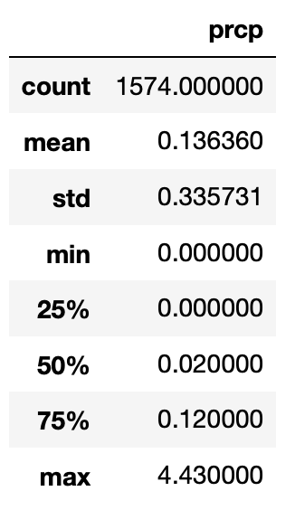
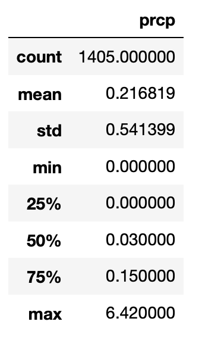

# Surfs_up

Using SQLite, Python and Flask to analyse weather data which will help in setting up a surf shop by the beach.

# Project Overview

The goals of this challenge are for you to:
  1. Determine key statistical data about the month of June.
  2. Determine key statistical data about the month of December.
  3. Compare your findings between the month of June and December.
  4. Make 2 or 3 recommendations for further analysis.
  5. Share your findings in the Jupyter Notebook.
  
  # Resources
  
  Data : hawaii.sqlite
  
  Software: Python 3.7.7, Anaconda 2019.07, Conda 4.11.7, Jupyter Notebook, Pandas, Matplotlib, Flask, SQLite
  
  # Summary
  
  June Precipitation                                        |  December Precipitation
:----------------------------------------------------------:|:---------------------------------------------------------:
 | 

### Findings:
- We can see that we have more data points for June(1574) than for December(1405). This could be because data was incorrectly recorded or was not available in December.
- The mean precipitation for the month of December is 0.22 whereas mean precipitation for June is 0.14. This shows on average there is more rainfall in December than June.
- The standard deviation for december is 0.54 and sd for June is 0.34. This relatively higher sd for December shows that the values for that month are more spread out and deviate further from the mean than in June.
- Looking at min and max values, we cvan see that the range for Dec is greater than June.

### Reccomendations:
- We can compare month on month data to see the treand throughout the year.
- We can look at the number of days it rained on average each month rather than the average rainfall throughout month. That would help predict the number of days the shop can remain open.
- We can determine if there is any correlation between the temperature and the level of precipitation. It can help build a model to accurately predict future values.
